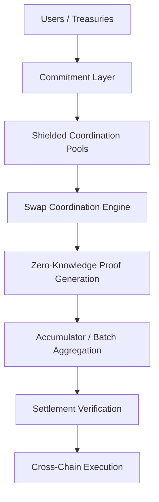

# BCYX

> Privacy-first cross-chain coordination and settlement infrastructure.

## Overview

BCYX is a privacy-first coordination protocol for confidential interoperability, selective disclosure, and verifiable cross-chain execution.

The protocol abstracts swaps, settlement intents, and execution flows through:
- cryptographic commitments,
- shielded coordination pools,
- aggregated Zero-Knowledge Proofs,
- and accumulator-based verification.

Instead of exposing:
- transaction graphs,
- routing paths,
- counterparties,
- or treasury allocations,

BCYX separates:
- public verification,
from:
- private coordination.

The initial pilot validates BCYX as a confidential swap coordination mechanism for atomic cross-chain settlement.

---

## Core Thesis

Current interoperability systems optimize for:
- messaging,
- bridging,
- and liquidity transport.

BCYX focuses on:
- confidential coordination,
- batched verification,
- and privacy-preserving settlement execution.

```txt
Public verification.
Private coordination.
```

---

## Pilot Scope

The first BCYX pilot tests:
- private atomic swap coordination,
- shielded settlement execution,
- proof aggregation,
- accumulator synchronization,
- and selective disclosure flows.

The goal is to validate BCYX as:
- a modular coordination layer,
- not simply a bridge,
- and not a generalized messaging protocol.

---

## Architecture



---

## Core Components

### Commitment Layer
Execution intents are represented as cryptographic commitments abstracting:
- ownership,
- amounts,
- routes,
- and settlement metadata.

---

### Shielded Coordination Pools
Private environments for:
- swap matching,
- confidential execution,
- and atomic coordination.

---

### Zero-Knowledge Verification
BCYX verifies:
- commitment validity,
- swap correctness,
- settlement integrity,
- and execution consistency

without revealing:
- balances,
- ownership,
- or internal execution state.

---

### Batch Proof Aggregation
Transactions are compressed into aggregated verification proofs using accumulators.

```txt
Tx1
Tx2
Tx3
Tx4
 ↓
Single Aggregated Proof
```

This reduces:
- verification overhead,
- settlement costs,
- and synchronization complexity.

---

## Target Properties

- Privacy-by-default
- Atomic coordination
- Modular verification
- Aggregated scalability
- Chain-agnostic interoperability

---

## Future Use Cases

The architecture extends toward:
- private treasury coordination,
- institutional settlement,
- confidential interoperability,
- oracle attestation systems,
- proof markets,
- and selective-disclosure financial infrastructure.

---

## Status

Pilot / Research Phase

Current work focuses on:
- swap coordination,
- shielded execution,
- and aggregated proof infrastructure.

---

## References

- Accumulate Network Whitepaper
- BitVMX
- zkSTARKs
- Cairo
- Stateful Merkle Trees
- Recursive Proof Aggregation

---

Keywords: Bitcoin-native, Atomic settlement, Shielded coordination, Verifiable privacy