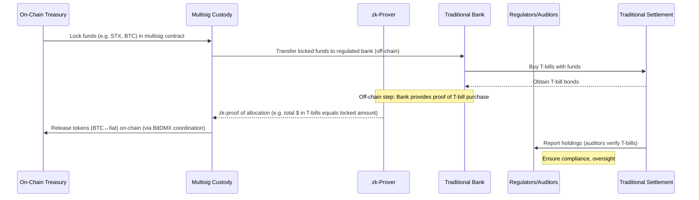

# BitDMX: Trust-Minimized ZK Credentials on Bitcoin

**Executive Summary:** BitDMX is a protocol for issuing and verifying privacy-preserving credentials on Bitcoin-aligned infrastructure. It lets users prove statements about their private data (e.g. _“age ≥ 18”_ or _“KYC passed”_) via zero-knowledge proofs, without revealing the underlying data. BitDMX combines a **Cairo zk-prover** (for off-chain proof generation), **Clarity smart contracts** on Stacks (for public coordination and dispute resolution), an optional **BitVMX path** for on-chain enforcement on Bitcoin【5†L49-L58】【14†L297-L305】, and an optional **Chia-based credential layer** for off-chain identity DIDs and VC tokens.  

The architecture provides a rigorous trust model: users compute a commitment to their data and a STARK proof. A network of **verifiers** (who stake collateral) check proofs off-chain and submit attestations on-chain via Clarity. If a threshold is met and no successful challenge occurs within a set window, the proof is accepted and a credential is issued (as a Stacks record or Chia VC). In the future, BitDMX can leverage **BitVMX** to finalize proofs on Bitcoin itself【5†L49-L58】【19†L65-L69】.  

Developers build with BitDMX by integrating a Cairo zk-program (for proof generation) and a Stacks.js/Clarity client (for submissions and reads). This README covers: the end-to-end architecture (with diagrams), data models, developer flows (with sample code), security and threat model (including staking/slashing for verifiers), privacy vs compliance considerations, deployment/CI steps, testing strategy, and an illustrative design for a high-level “cryptographic bridge” moving treasury funds into traditional assets (e.g. T-bills) with zk-proofs and multisig custody. 

<p align="center">⚖️ <em>“Prove what’s true. Reveal nothing else.”</em> ⚖️</p>

## Architecture Overview

```mermaid
flowchart TD
    subgraph OffChain
      direction TB
      A[User Data (e.g. birthdate, score)] --> B[Cairo zk-Prover]
      B --> C[zk-STARK Proof + Commitment]
      C --> D[Stacks Transaction: SubmitProof(commitment, proof, metadata)]
      C --> E[Chia DID & VC mint (optional)]
    end

    subgraph OnChain (Stacks)
      direction TB
      D --> F[Proofs Map: record commitment, submitter, status]
      F --> G[Verifiers (staked entities)]
      G --> H[approve-proof(commitment)]
      H --> F
      F --> I{Enough Approvals?}
      I --> |No| F
      I --> |Yes| J{Challenge Window}
      J --> |Expired| K[finalize-proof(commitment) → mark credential valid]
      J --> |Challenge| L[challenge-proof(commitment) → mark rejected & slash]
    end

    subgraph OnBitcoin (BitVMX) 
      direction TB
      L1[Cairo Prover Output (proof)] --> L2[SNARK Compression (optional)] 
      L2 --> L3[BitVMX Verifier (RISC-V CPU)] 
      L3 --> L4[Bitcoin Dispute (Taproot unlock)]
    end

    subgraph OffChain_Credential
      direction TB
      K --> M[Issue Stacks Credential]
      K --> E[Issue Chia VC Coin (optional)]
      M --> End[App Access Granted]
      E --> End
    end
```

- **Cairo zk-Prover:** Runs off-chain (in a node or client). Takes the user’s secret data (e.g. birthdate, randomness) and public parameters (country, current date, commitment). It checks constraints (e.g. computes age and verifies `age ≥ legal_age(country)`, and verifies `Hash(data||r) == commitment`) and outputs a STARK proof. The proof commits to the computation **without revealing secrets**【19†L65-L69】【5†L84-L93】.
- **Commitment:** A cryptographic hash binding secret data and randomness: `commitment = Hash(data || r)`. This is sent on-chain with the proof, preventing data from changing later.
- **Stacks Clarity Contract:** Receives `submit-proof(commitment, proof, metadata)`. It stores the submission and awaits off-chain verifiers. Verifiers (pre-registered staking participants) each call `approve-proof(commitment)` if they checked the proof. If the number of approvals ≥ threshold (e.g. 2/3 of verifiers), the contract enters a **challenge window**. If no valid challenge occurs (via `challenge-proof`) within that block window, anyone can call `finalize-proof(commitment)` to mark it *finalized*. A successful challenge (proof incorrect) causes rejection and potential slashing of verifiers’ stake.
- **Chia Credential Layer (optional):** After finalization, the system can mint a Chia DID-based Verifiable Credential (VC) or COLORED coin representing the verified claim【8†L73-L81】. This leverages Chia’s DID/VC primitives, enabling interoperability with Chia wallets. For example, the VC’s fields include the commitment and the result flag.
- **BitVMX Verification (future):** For ultimate trustlessness, BitVMX can verify the proof on Bitcoin. A SNARK or STARK proof of the Cairo computation is compressed into a compact proof, and BitVMX’s RISC-V virtual CPU (inside a Taproot script) verifies it【5†L84-L93】【19†L65-L69】. This removes reliance on off-chain verifiers: Bitcoin script itself enforces correctness via dispute.

## Components and Data Models

### BitDMX Prover (Cairo)

- **Purpose:** Generate STARK proofs for predicates over secret data.
- **Environment:** Cairo (e.g. via StarkNet’s Cairo or RISC-Zero). Uses algebraic constraints to encode logic.
- **Public Inputs:** Commitment (hash), metadata (e.g. country code, current date).
- **Private Inputs:** Original data (birthdate, credit score, etc.) and random nonce.
- **Outputs:** `proof` object (binary); public signals/inputs (like commitment).
- **Languages/Tools:** Cairo (and libraries), StarkWare docs【19†L65-L69】.

Example Cairo predicate (pseudocode):
```cairo
func is_age_valid(birthdate: felt, r: felt, country: felt, commitment: felt, current_date: felt) -> () {
    # Verify commitment matches secret data
    let computed_hash = pedersen_hash(birthdate, r);
    assert computed_hash == commitment;
    # Compute age
    let age = compute_age(current_date, birthdate);
    let legal_age = get_legal_age(country);
    assert age >= legal_age;
    return ();
}
```
This circuit ensures the user’s secret birthdate yields the public `commitment`, and that the age ≥ threshold.

### Stacks Clarity Contracts

- **Purpose:** Coordinate verifiers, store commitments, handle challenges, issue credentials.
- **Key State (maps):** 
  - `proofs` table: `{ commitment: (buff 32) } → {submitter, approvals, rejected, finalized, created_at}`.
  - `approvals` table: `{commitment, verifier} → {approved}`.
  - `verifiers` registry: `{verifier: principal} → {active: bool}`.
- **Functionality:**
  - `submit-proof(commitment, proof, metadata)`: records a new proof (errors if commitment exists).
  - `approve-proof(commitment)`: verifiers sign off (increases `approvals` count).
  - `challenge-proof(commitment)`: any user flags it as invalid (sets `rejected = true`).
  - `finalize-proof(commitment)`: once `approvals >= threshold` and window passed, marks it valid (sets `finalized = true`).
  - `is-valid(commitment)`: read-only, returns `(get finalized && !rejected)` for access logic.
- **Staking/Collateral:** Each verifier could deposit STX into contract; if challenge finds fraud, slashes collateral. (Design this via additional state like `verifier-stakes` map.) Clarity’s decidability and safe features【9†L147-L155】 help avoid common bugs.
- **Sample Clarity Snippet (simplified):**
  ```clarity
  (define-map proofs 
    {commitment: (buff 32)}
    { submitter: principal, approvals: uint, rejected: bool, finalized: bool, created-at: uint })

  (define-public (approve-proof (commitment (buff 32)))
    (let ((p (map-get? proofs {commitment: commitment})))
      (begin
        (asserts! (is-some p) ERR_NOT_FOUND)
        (asserts! (not (get finalized (unwrap! p ERR_NOT_FOUND))) ERR_ALREADY_FINALIZED)
        (map-set proofs {commitment: commitment}
          {
            submitter: (get submitter (unwrap! p ERR_NOT_FOUND)),
            approvals: (+ (get approvals (unwrap! p ERR_NOT_FOUND)) u1),
            rejected: (get rejected (unwrap! p ERR_NOT_FOUND)),
            finalized: (get finalized (unwrap! p ERR_NOT_FOUND)),
            created-at: (get created-at (unwrap! p ERR_NOT_FOUND))
          })
        (ok true))))
  ```
- **Integrations (Stacks.js):** The DApp (e.g. Next.js) uses Stacks.js to submit proofs and read state. Example read-only call:
  ```js
  import { callReadOnlyFunction, bufferCVFromString } from '@stacks/transactions';
  import { StacksMainnet } from '@stacks/network';

  const result = await callReadOnlyFunction({
    contractAddress: 'ST1ABC...', contractName: 'bitdmx',
    functionName: 'is-valid',
    functionArgs: [bufferCVFromString(commitmentHex)],
    network: new StacksMainnet(),
    senderAddress: userAddress,
  });
  const isValid = result?.value === true;
  ```
  This pattern is documented in Stacks.js guides【14†L297-L305】.

### Data Model Tables

| **Proofs**          | Type            | Description                                     |
|---------------------|-----------------|-------------------------------------------------|
| `commitment`        | `buff 32`       | User’s data commitment                          |
| `submitter`         | `principal`     | Address that submitted the proof                |
| `approvals`         | `uint`          | Number of verifier approvals (so far)           |
| `rejected`         | `bool`          | Flag if a challenge marked it invalid           |
| `finalized`         | `bool`          | Flag if passed threshold and window elapsed     |
| `created-at`        | `uint`          | Block height when submitted                     |

| **Approvals**       | Type            | Description                                     |
|---------------------|-----------------|-------------------------------------------------|
| `commitment`        | `buff 32`       | Linked to Proofs table                          |
| `verifier`         | `principal`     | Verifier address                                |
| `approved`          | `bool`          | Always true if present                          |

| **Credentials**     | Type            | Description                                     |
|---------------------|-----------------|-------------------------------------------------|
| `commitment`        | `buff 32`       | Links back to proof                            |
| `result`            | `bool`          | Outcome of predicate (true/false)              |
| `timestamp`         | `uint`          | When finalized in Stacks                       |

*(For Chia, credentials are stored as DID VCs: see Chia’s docs【8†L75-L84】. We treat each VC as a coin with metadata.)*

### Incentives: Staking and Slashing

- **Verifiers:** Entities (or apps) run verifier software, earn fees for honest proofs. They must *stake* collateral (in STX) in the contract. For example, each verifier registers by sending X STX to the contract, stored in `verifier-stakes` map.
- **Slashing:** If a proof is successfully challenged (verifier submitted a bad proof), losing verifiers have some collateral *slashed*. This can be redistributed to the challenger or burned. Slashing logic is invoked in `challenge-proof`.
- **Threshold and Window:** The contract parameter `verifier-threshold` (e.g. 3 of 5) sets required sign-offs. The `challenge-window` (e.g. 144 blocks ≈1 day) gives time to dispute【11†L169-L178】.
- **Design Notes:** Ensure at least one honest verifier and at least one honest challenger【5†L65-L74】. The contract should clearly define punishable misbehavior (e.g. signing a false proof) and equal rewards for valid challenges.
- **Currency:** We assume a future BITDMX token (ERC-20 style) for staking and rewards. For now, STX or other secure reserve asset could be used for collateral.

### Security & Threat Model

- **Trust Minimization:** BitDMX aims that no single party (not the prover, verifier, or app) can cheat without risk of detection and slashing. 
- **ZK Soundness:** If the prover is malicious, a valid STARK proof cannot be forged without solving the underlying statement (computationally infeasible)【19†L65-L69】.
- **Verifier Collusion:** If enough verifiers collude (≥ threshold), they could accept a false proof. Mitigation: keep threshold high, open the set to many random verifiers, or rely on final BitVMX dispute.
- **Reentrancy/Overflow:** Clarity’s decidability and safety features prevent reentrancy and arithmetic bugs【9†L147-L155】.
- **Replay/Invalid Prover:** The `commitment` ensures uniqueness (no double-spend of claims). Nonces/randomness in proving prevent reuse.
- **Off-Chain Risks:** User’s device must protect secrets. The system never stores raw data on-chain.

### Privacy & Compliance

- **Privacy Benefits:** Only cryptographic proofs and hashes are on-chain. Sensitive user data (birthdate, documents) never leaves prover environment.
- **Linkability:** If users reuse commitments, linking is possible. In practice, randomize each credential (fresh r).
- **Regulatory Trade-offs:** BitDMX is privacy-forward, but not fully anonymous: on-chain credential records link to user addresses. KYC/AML might require known identities off-chain (verifiers might be regulated entities). The system can incorporate optional real-identity attestations via Chia DIDs.
- **Jurisdiction Flags:** Ensure every proof checked complies with local law. E.g. proof “is over 21” is cross-border safe, but exact birthdate is not exposed.
- **Zero-Knowledge:** Proof systems are post-quantum secure and “transparent” (no toxic setup)【19†L65-L69】.

## Developer Integration

### End-to-End Flow

1. **User generates proof:** In a Next.js (or similar) app, the user enters data (e.g. birthdate) and the DApp calls the Cairo prover (either via a WASM module or backend service). The prover returns `(proof, commitment)`.
2. **Submit to Stacks:** The frontend sends a transaction to `bitdmx` contract: 
   ```js
   const txOptions = {
     contractAddress: CONTRACT_ADDRESS,
     contractName: 'bitdmx',
     functionName: 'submit-proof',
     functionArgs: [
       bufferCVFromString(commitmentHex),
       // ...include proof (likely off-chain or in metadata)
     ],
     senderKey: userPrivateKey,
     network
   };
   const tx = await makeContractCall(txOptions);
   await broadcastTransaction(tx);
   ```
3. **Verifiers approve:** Independent nodes listen for new submissions. Each runs `verifyProof(commitment, proof)` off-chain. If valid, they call `approve-proof(commitment)` via a transaction (using their stake keys).
4. **Challenge (optional):** If any party detects a bad proof, they call `challenge-proof(commitment)`. This triggers slashing and marks invalid.
5. **Finalize:** After threshold approvals and window (e.g. 1 day), anyone (or the original submitter) calls `finalize-proof(commitment)`. The contract records it as valid.
6. **Credential Issuance:** The app then queries `is-valid(commitment)`【14†L297-L305】; if true, it grants access or mints a Chia VC. For Chia, it invokes the Chia CLI/SDK to issue a DID and mint a VC with the `commitment` and timestamp (per [8] guide).
7. **Access:** The frontend can store the final proof or credential token as a session token. Future access checks simply read from BitDMX contract or verify the Chia VC.

### Sample Code Snippets

**Next.js / Stacks.js (Submitting a proof):**
```js
import { makeContractCall, broadcastTransaction, bufferCVFromString } from '@stacks/transactions';
import { StacksMainnet } from '@stacks/network';

// after obtaining proof and commitment
async function submitProof(commitmentHex, proofBlob) {
  const txOptions = {
    contractAddress: 'SP3...',
    contractName: 'bitdmx',
    functionName: 'submit-proof',
    functionArgs: [bufferCVFromString(commitmentHex)],
    network: new StacksMainnet(),
    senderKey: userKey,
    fee: 500, // adjust as needed
  };
  const tx = await makeContractCall(txOptions);
  const result = await broadcastTransaction(tx);
  console.log('Submitted commitment, txid:', result.txid);
}
```

**Cairo Prover (outline):**
```cairo
# include necessary libraries and hash functions

struct PublicInput {
    commitment: felt,
    country: felt,
    current_date: felt,
    legal_age: felt,
}
func compute_age(birthdate: felt, current_date: felt) -> felt { ... }

func is_age_valid(public_input: PublicInput, birthdate: felt, r: felt) {
    # Check commitment
    let computed = pedersen_hash(birthdate, r);
    assert computed == public_input.commitment;

    # Age check
    let age = compute_age(birthdate, public_input.current_date);
    assert age >= public_input.legal_age;

    return ();
}
```
After compiling and executing, a STARK proof is generated (e.g. via StarkNet or RISC-Zero tooling). 

**Clarity Contract Interaction (Simplified):**
```clarity
(define-public (submit-proof (commitment (buff 32)))
   ...)

(define-public (approve-proof (commitment (buff 32)))
   ...)

(define-public (finalize-proof (commitment (buff 32)))
   ...)

(define-read-only (is-valid (commitment (buff 32)))
   (ok (and (get finalized (unwrap! (map-get? proofs {commitment: commitment}) 0))
            (not (get rejected (unwrap! (map-get? proofs {commitment: commitment}) 0))))
))
```

### Sequence Diagram: Treasury → T-Bills Bridge



1. **Funds Lock:** Treasury smart contract locks crypto (e.g. STX) in a multisig (threshold of operators).
2. **Custody Transfer:** Operators transfer equivalent funds to a bank; bank uses them to buy short-term T-bills.
3. **Proof Generation:** Bank/operator generates a zero-knowledge proof that _exactly those funds_ have been moved into liquid T-bills (without revealing identity of T-bill purchases or excess funds).
4. **On-Chain Settlement:** The multisig contract receives the ZK proof and validates it. Upon success, it may mint stablecoins or release an equivalent on-chain representation (e.g. a USD token).
5. **Governance & Compliance:** Regulators/auditors have oversight; require disclosures off-chain (KYC of participants, public audit logs). The zk-proof hides transaction details while proving compliance.

**Risks/Controls:** Smart contract bugs, operator collusion, legal constraints (e.g. is bridging into securities allowed?), auditability. A robust governance (e.g. DAO oversight, audit trails, limits) is essential.

## Deployment & Testing

- **Clarity Contracts:** Use [Clarinet](https://docs.stacks.co/stacks-cli/clarinet) or Stacks.js scripts for local dev and testing【14†L297-L305】. Include unit tests for submit/approve/challenge/finalize flows. Test failure cases (double submissions, insufficient approvals, slashing).
- **Cairo Prover:** Develop tests with StarkNet-foundry or RISC-Zero frameworks. Write unit tests for edge cases (boundary ages, invalid inputs).
- **CI/CD:** 
  - Automate Cairo proof compilation (e.g. GitHub Actions: on push, build StarkNet/Cairo projects).
  - Lint and test Clarity (using Clarinet).
  - Automated deploy to Stacks Testnet; deployment scripts in `scripts/`.
- **Integration Testing:** Use a local Stacks node or testnet. Simulate a full end-to-end: user->prover->contract->verify->finalize. 
- **ZK Proof Validation:** Verify each proof off-chain independently (as part of tests) to ensure false proofs fail.
- **On-Chain Simulation:** Use Stacks Testnet to simulate reorgs, high load (test gas usage).
- **Security Audits:** Before mainnet, audit Clarity code (its decidability aids analysis) and ZK circuits.

## License & Repository

- **License:** MIT or Apache-2.0 for code; ensure license compatibility across components (Stacks = Apache2, Cairo = Apache2, etc).
- **Repo Structure (suggested):**  
  ```
  /contracts                # Clarity (.clar) source
  /prover                   # Cairo (or RISC-Zero) code
  /prover/tests             # Cairo unit tests (StarkNet-foundry etc.)
  /web                     # Next.js or frontend integration
  /scripts                 # deployment scripts (deploy contracts, prover build)
  /docs                    # architecture diagrams, setup instructions
  .github/workflows        # CI/CD pipelines
  ```
- **Open Source:** Consider GNU AGPL or Apache 2.0 for openness.

## References

- **Stacks / Clarity:** Official docs on Clarity language and Stacks.js integration【9†L147-L155】【14†L297-L305】.
- **Cairo / ZK-STARKs:** StarkWare docs on Cairo and STARKs【19†L65-L69】【19†L49-L57】.
- **BitVMX:** BitVMX technical posts (fraud proofs, ZK on Bitcoin)【5†L84-L93】【5†L147-L154】.
- **Chia Credentials:** Chia DID/VC guides (DID and VC issuance)【8†L75-L84】.
- **Cryptography:** General ZK-STARK overviews【19†L65-L69】.
- **Staking/Slashing:** Common PoS literature (ETH slashing basics【6†L4-L12】).
- **Security:** Stacks security principles (Clarity is decidable)【9†L147-L155】.

This README has covered the BitDMX system design end-to-end. For further details on each component, consult the linked official documentation and academic papers.

